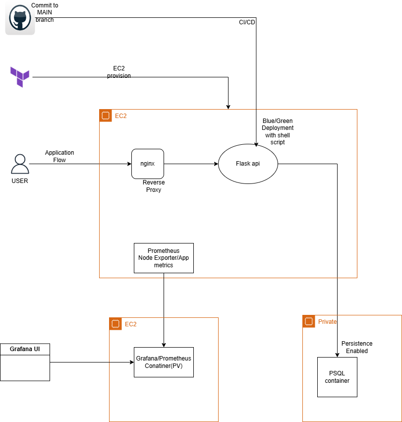

# Task Tracker API - Blue-Green Deployment

This project sets up a **Task Tracker API** and utilizes a **Blue-Green deployment** strategy to ensure zero-downtime updates. The API is containerized using Docker, and the deployment process is automated using shell scripts. The API is deployed on an **EC2 instance** with traffic switching between two application containers (blue and green).

### Prerequisites

- Setting up the **DB VM** and **Monitoring VM** either with **Terraform** or manually.
- Configure the database with persistent volume (PV) and monitoring with persistent volume claim (PV).
- **taskapi.drawio.png** diagram for visual setup.

### Architecture



### Components:
- **Users** access the Task Tracker API via HTTP requests.
- **Task Tracker API** is containerized and deployed in Docker.
- **Blue-Green Deployment**: Shell script ensures zero-downtime deployment by running two containers (blue and green), and switching between them based on health checks.
- **AWS EC2 Instance**: Hosts the Docker containers running the API.
- **AWS Security Groups**: Control access to the EC2 instance.
- **Nginx**: Acts as a reverse proxy, directing traffic to the active application container maintaing blue-green strategy.
- **CI/CD Pipeline**: GitHub Actions or GitLab CI for building and deploying the Docker image automatically.

---

## Setup

### 1. Infrastructure Setup

The infrastructure for the Task Tracker API is provisioned using **Terraform**. To get started:

1. Clone the repository.
2. Install **Terraform** on your local machine.
3. Configure your **AWS credentials** to allow Terraform to provision resources.
4. Navigate to the `terraform/` directory and run the following Terraform commands:

```bash
terraform init
terraform apply
---
## Terraform provisions:

- **Application EC2 Instance** (Docker container for the API).

After running `terraform apply`, Terraform will output the **public IP** of the EC2 instance (Application) and s3 bucket.

--------------------------------------

## 2. Database Setup

### 2.1 Provision Database EC2 Instance

- Set up the EC2 instance for the database. If this is done manually, ensure the instance has proper security groups and access.

### 2.2 Run PostgreSQL in Docker

Run the following command to launch the PostgreSQL container:

```bash
docker run -d \
  --name my_postgres \
  -p 5432:5432 \
  -e POSTGRES_USER=<taskuser> \
  -e POSTGRES_PASSWORD=<pocpassword> \
  -e POSTGRES_DB=<taskdb> \
  -v pg_data:/var/lib/postgresql/data \
  postgres:15
---------------------------------------------------------


## 2.3 Update Database Credentials in `.env`

Once the PostgreSQL container is up, update the `.env` file in the repository to reflect the correct database credentials:

```env
DB_HOST=localhost
DB_PORT=5432
DB_NAME=taskdb
DB_USER=taskuser
DB_PASSWORD=pocpassword

------------------------------------------------------

## 3. Application Deployment (Docker & Blue-Green Deployment)

### 3.1 Dockerize the Application

The Dockerfile for the application is located in the root of the repository. To build the Docker image manually, run the following:

```bash
docker build -t yourdockerhubusername/task-tracker:latest .

-----------------------------------------------------
### 3.2 Deploy using `deploy.sh`

The `deploy.sh` script handles the deployment using the Blue-Green strategy. It ensures the new container is healthy before switching traffic.

Usage of `deploy.sh`:

```bash
./deploy.sh

-----------------------------------------------------
## 4. CI/CD Pipeline

The CI/CD pipeline is configured with **GitHub Actions**.  
The pipeline configuration can be found in `./github/workflows/deploy.yml`.  
It is automatically triggered whenever there is a push to the **main** branch.

-----------------------------------------------------


## 5. Monitoring with Prometheus & Grafana

### 5.1 Install Prometheus & Grafana

Install **Prometheus** and **Grafana** on the **Monitoring EC2 instance** to collect and visualize metrics.

### 5.2 Persistent Volume Claim (PVC)

Ensure **Prometheus** and **Grafana** use PVC for persistent metrics data storage.

### 5.3 Install Node Exporter on EC2 (Node)

To collect system-level metrics (e.g., CPU, memory, disk usage) from the EC2 instance, you'll need to install the **Node Exporter**.

1. **Download and Install Node Exporter**:
   - SSH into your **EC2 instance** (node).
   - Download the latest release of **Node Exporter** from GitHub:

```bash
cd /opt
wget https://github.com/prometheus/node_exporter/releases/download/v1.3.1/node_exporter-1.3.1.linux-amd64.tar.gz
tar -xvzf node_exporter-1.3.1.linux-amd64.tar.gz
cd node_exporter-1.3.1.linux-amd64

5.4 Configure Scrape Config for Application and Node

To collect metrics from the application and the EC2 instance (node), you need to configure Prometheus to scrape data from both.

Prometheus Configuration (prometheus.yml): Update the prometheus.yml configuration file to scrape metrics from the application container and the EC2 instance.

```yaml
scrape_configs:
  - job_name: 'node'
    static_configs:
      - targets: ['<ec2-public-ip>:9100']  # EC2 Node Exporter

  - job_name: 'application'
    static_configs:
      - targets: ['<ec2-public-ip>:8000']  # Application metrics endpoint
------------------------------------------------------
## 6. Nginx Reverse Proxy & Blue-Green Strategy

Nginx is configured as a reverse proxy to serve the application and maintain the **Blue-Green deployment** strategy.  
The application is running on **port 80**.

------------------------------------------------------
7. Testing the API

Once deployed, test the Task Tracker API using Postman or cURL:
Example:
post curl 
curl -X POST http://<ip>/tasks \
  -H "Content-Type: application/json" \
  -d '{
        "title": "Learn FastAPI",
        "start_date": "2026-01-10",  # Make sure this is in the correct format
        "end_date": "2026-01-15",
        "completed": false
      }'


curl http://<your-ec2-public-ip>/tasks
